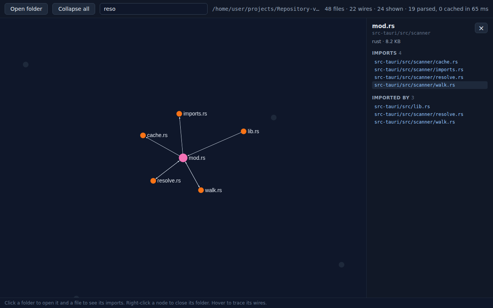
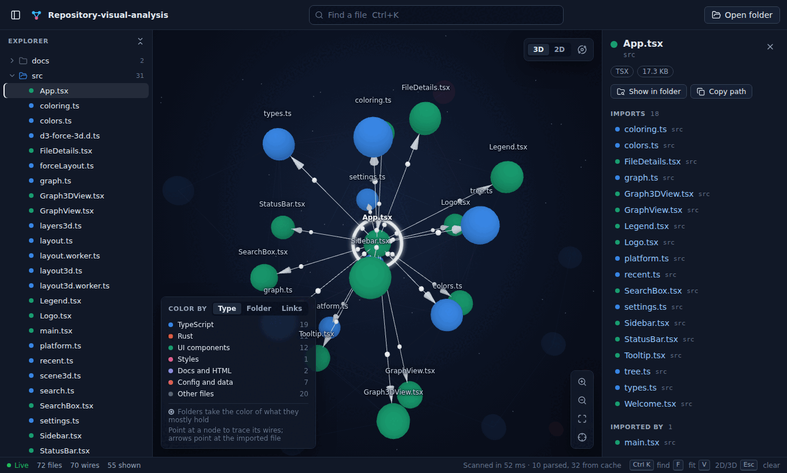
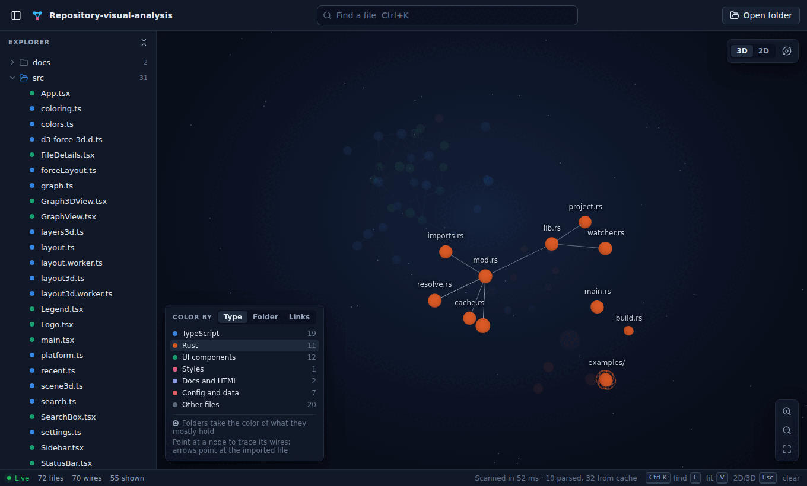

# Repository Visual Analysis

A desktop app that draws a code project as a graph: files and folders are nodes, and the
imports between them are wires. The graph opens in 3D, so you can turn it like a globe and
look at it from any side, and a flat 2D view is one key away.



## Using it

- **Open a project** with the Open folder button, **Ctrl+O** (Cmd+O on macOS), or by dropping
  a folder onto the window. The welcome screen lists recent projects.
- **Open a second project side by side** with **Ctrl+Shift+N** (Cmd+Shift+N on macOS) or the
  new-window button at the top right. Each window has its own project, live updates and
  settings for what it shows, and its title names the project so windows are easy to tell
  apart.
- Click a folder to open it, and right-click any node to close the folder it sits in. The
  **Explorer** on the left (**Ctrl+B** hides it) opens and closes the same folders, and
  hovering one of its rows traces that node in the graph.
- Click a file to see what it imports and what imports it. Every entry in that panel jumps
  to that file, and **Show in folder** and **Copy path** hand the file to your other tools.
- **Key files**, the second tab of the explorer, lists where to start reading a new
  project: the files the rest of it leans on most. A file ranks mostly by how many files
  import it, and also by how many it imports and how big it is. Type, util and index files
  rank lower, since they are imported widely but rarely hold the work, and tests, docs and
  examples are left out. Click one to open the folders above it and select it.
- The funnel button at the top right (or **H**) **hides tests, docs, examples, benchmarks,
  vendored and generated files and lockfiles**, so the graph shows the code that runs. The
  status bar counts what is hidden; click the count to show them again.
- Press **Ctrl+K** to find a file by name. Picking one opens the folders above it and
  centres the graph on it.
- Hover a node to trace its wires and see a short summary. Arrows on the traced wires point
  at the imported file.
- In 3D, **drag** to turn the graph, **scroll** to zoom and **right-drag** to move it. The
  globe button at the top right (or **R**) turns it slowly on its own. **V** switches between
  3D and 2D.
- Zoom with the scroll wheel, the buttons at the bottom right, or **+** and **−**. **F** fits
  the whole graph and **Esc** clears the selection.
- **Live** in the status bar means the folder is watched: saving a file redraws the graph.
- **Export** the graph with the picture button under the zoom buttons. **PNG** and **SVG**
  save a picture of what is shown (the open folders, the colours and, in 3D, the current
  angle) with a colour key. **Save as Mermaid** writes a `.mmd` flowchart, and **Copy Mermaid**
  puts one on the clipboard to paste into a `mermaid` code block in a README or pull request,
  where GitHub draws it. Open folders become boxes around their files, and a wire that
  stands for several imports is labelled with the count.



### Colours

The key at the bottom left picks what the colours mean:

- **Type** (the default): TypeScript, Rust, UI components, JavaScript, styles, Python, docs,
  config and other code each get their own colour, and a folder takes the colour of what it
  mostly holds. The colours were checked to stay apart for colour-blind readers too.
- **Folder**: each top-level folder gets its own colour, so you can see which part of the
  project a file belongs to.
- **Links**: nodes shade from dark blue to near white by how many wires they have, so the
  busiest files stand out.

Point at a row of the key to pick those nodes out: everything else fades back.



## How it stays fast on big repositories

- **Parallel scan in Rust.** The `ignore` crate (ripgrep's walker) lists files on every core
  and skips whatever `.gitignore` excludes, plus `node_modules/`, `target/`, `dist/`, `build/`
  and `__pycache__/` even when no `.gitignore` mentions them.
- **Imports only.** tree-sitter reads just the import statements of each source file. Files
  over 1 MB (bundles, generated code) are listed but not parsed.
- **Cache.** Parsed imports are saved per project with each file's size and modified time,
  so reopening a project only re-parses files that changed.
- **Folders first.** The first view shows one node per folder, with wires summed from the
  files inside. Click a folder to open it, right-click a node to close its folder. Only what
  is open gets drawn.
- **GPU drawing.** In 3D, three.js draws all spheres in one batch, all folder globes in
  another and all wires in a third, so thousands of nodes cost a handful of draw calls. In 2D,
  Sigma.js renders the graph with WebGL.
- **Layout off the UI thread.** Both layouts (d3-force-3d in 3D, ForceAtlas2 in 2D) run in a
  Web Worker, so the window stays responsive while a big folder is arranged, and clicking
  several folders quickly only lays out the last state. When a folder opens, the nodes already
  placed hold still while the new ones spread out. The explorer only draws the rows in view.
- **Live updates.** The open project is watched, and a burst of edits (a save, a
  `git checkout`) redraws the graph once the changes settle. Churn under ignored folders
  is skipped, and the open folders stay open across the redraw.

Measured on a 4-core cloud machine: 12,700 files (8,700 Rust sources) scan in 5.2 s the first
time and 44 ms with the cache.

## Languages

| Language | What becomes a wire |
| --- | --- |
| JavaScript / TypeScript / TSX | `import`, `export … from`, `require()`, `import()` of relative paths, and of aliases like `~/lib/db` or `@/components/Button` set by `paths` and `baseUrl` in the nearest `tsconfig.json` or `jsconfig.json` |
| Python | `import a.b`, `from .x import y` (relative and absolute) |
| Rust | `mod name;` declarations and `use` paths (`crate::`, `self::`, `super::`) |

Imports of outside packages (npm, pip, crates, the standard library) are not drawn.

## Project layout

```
src/                 React frontend
  App.tsx            open project, folder and selection state, keyboard shortcuts
  Welcome.tsx        start screen with recent projects (stored by recent.ts)
  Sidebar.tsx        explorer that mirrors the graph (tree.ts builds its index)
  KeyFiles.tsx       the Key files tab; ranking.ts picks and orders them
  noise.ts           which files the hide switch leaves out (tests, docs, examples...)
  Graph3DView.tsx    3D view: hover, clicks and camera controls around scene3d.ts
  scene3d.ts         the 3D scene: camera, labels, tracing and auto-rotate
  layers3d.ts        batched three.js drawing of spheres, globes, wires and arrows
  layout3d.ts        3D force layout, run in layout3d.worker.ts
  GraphView.tsx      2D view: Sigma.js renderer, hover tracing and camera controls
  layout.ts          runs the 2D layout in layout.worker.ts and animates nodes into place
  graph.ts           folds files into their nearest open folder and sums wires
  colors.ts          file types and their colours; coloring.ts builds each colour mode
  Tooltip.tsx        the hover summary; settings.ts remembers view and colour choices
  SearchBox.tsx      Ctrl+K file search (ranking in search.ts)
  FileDetails.tsx    imports / imported-by panel for the selected file
  Legend.tsx         the colour key and colour mode switch
  ExportMenu.tsx     the export menu; exportGraph.ts builds the SVG, PNG and Mermaid
  StatusBar.tsx, styles.css
src-tauri/           Rust backend
  src/lib.rs         commands the frontend calls: scan_repository, reveal_in_file_manager
  src/export.rs      save_export: the save dialog and file write for exports
  src/project.rs     keeps file actions inside the open project
  src/scanner/       walk.rs (file listing), imports.rs (tree-sitter), resolve.rs,
                     aliases.rs (tsconfig paths), cache.rs
  src/watcher.rs     debounced file watching for live updates
  examples/scan.rs   command-line scan for benchmarking
```

## Running it

Prerequisites: Node 20+, Rust, and the [Tauri system dependencies](https://v2.tauri.app/start/prerequisites/)
for your OS (on Linux, `libwebkit2gtk-4.1-dev` and friends).

```sh
npm install
npm run tauri dev       # run the app with hot reload
npm run tauri build     # build an installer for this OS

cd src-tauri
cargo test              # scanner tests
cargo run --release --example scan -- /path/to/repo > scan.json
```
